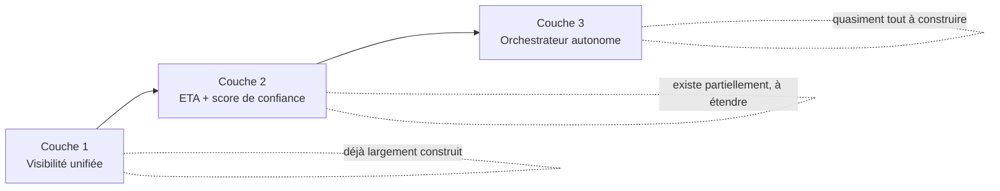

# Praxio (working name) — de la visibilité à l'action

> Plateforme d'orchestration modulaire ("Hubs") pour le commerce international et la logistique — née de la fusion de deux produits existants : [IncoKalk](https://github.com/Ybarzan/Incokalk) (conformité douanière, Incoterms, transporteurs internationaux) et [fleet-hub](https://github.com/Ybarzan/fleet-hub) (gestion de flotte poids lourds, GPS, tachygraphe). Ce dépôt est le nouveau monorepo cible ; les deux dépôts d'origine restent les sources de vérité historiques tant que la bascule n'est pas actée.

## Structure du dépôt

```
SaasModduleOS/
├── docs/                        # Stratégie, architecture, plan de migration (voir sommaire ci-dessous)
├── hubs/
│   ├── compliance-engine/       # ex-IncoKalk : douane, Incoterms, ETA, transporteurs internationaux, ERP
│   └── fleet-hub/                # ex-fleet-hub : flotte poids lourds, GPS, tachygraphe, dernier kilomètre
└── README.md
```

Chaque hub garde sa propre stack, son propre backend et sa propre base de données — voir [docs/07-integration-fleet-hub.md](docs/07-integration-fleet-hub.md) pour le choix explicite de **ne pas** fusionner les deux backends en un seul monolithe, et comment ils se parlent via API/webhook en s'appuyant sur l'orchestrateur de la Couche 3.

**Note sur la copie de code** : `hubs/compliance-engine` et `hubs/fleet-hub` sont des copies de l'état actuel des dépôts sources (23/08/2026), sans historique git préservé — l'historique complet reste consultable dans les dépôts d'origine. `hubs/fleet-hub` contenait un volume important de modifications non committées au moment de la copie ; elles sont incluses telles quelles (voir statut détaillé dans [docs/07-integration-fleet-hub.md](docs/07-integration-fleet-hub.md)).

## Le pitch

> *« Vos systèmes savent déjà qu'une expédition va être en retard. Praxio agit avant que ça devienne votre problème — réajuste la commande fournisseur, réalloue le stock, prévient le client — sans que vous ayez à ouvrir cinq écrans différents. »*

**Fermer l'écart entre savoir et faire — pour le commerce international.**

## Le constat de départ

L'audit du code existant (voir [docs/01-audit-existant.md](docs/01-audit-existant.md)) montre un socle plus mature qu'attendu : connecteurs transporteurs (DHL, MSC, CMA CGM, Geodis, DB Schenker), ERP bidirectionnel (Odoo, SAP B1), et un moteur ETA prédictif avec score de confiance déjà en production. Ce qui manque n'est pas la donnée — c'est la couche d'action : aucun moteur de règles conditionnelles au-delà d'un filtrage simple, aucun bus d'événements, aucune écriture automatique déclenchée par un événement métier. C'est précisément ce que cette refonte construit.

## Sommaire des livrables

| Document | Contenu |
|---|---|
| [docs/01-audit-existant.md](docs/01-audit-existant.md) | Audit factuel du code actuel, couche par couche, avec preuves (fichiers/services) |
| [docs/02-architecture-cible.md](docs/02-architecture-cible.md) | Architecture cible à 3 couches, diagrammes, composants, flux de données |
| [docs/03-plan-migration.md](docs/03-plan-migration.md) | Plan de migration en 3 phases avec jalons et Gantt indicatif |
| [docs/04-composants-techniques.md](docs/04-composants-techniques.md) | Détail de chaque nouveau composant technique, complexité relative |
| [docs/05-estimation-couts-risques.md](docs/05-estimation-couts-risques.md) | Estimation d'effort (2 lectures : cadence réelle vs semaines-personnes classiques) et risques par ordre d'impact |
| [docs/06-positionnement-gtm.md](docs/06-positionnement-gtm.md) | Nouveau pitch, propositions de nom, segmentation tarifaire, stratégie de mise sur le marché |
| [docs/07-integration-fleet-hub.md](docs/07-integration-fleet-hub.md) | Pourquoi et comment intégrer fleet-hub comme un Hub à part entière (architecture, pas fusion de code) |
| [docs/08-refonte-frontend.md](docs/08-refonte-frontend.md) | Scope réaliste et priorisation de la refonte frontend (nouveau design system, unification des deux apps) |
| [docs/09-design-system.md](docs/09-design-system.md) | Étape 0 livrée : palette, typographie, layout — [aperçu visuel](https://claude.ai/code/artifact/3bd4f46d-4895-434c-ab3d-476bd56b284b) (palette, composants, maquette de la nouvelle coquille) |

## Architecture cible en un coup d'œil



Détail complet dans [docs/02-architecture-cible.md](docs/02-architecture-cible.md).

## Principes qui contraignent chaque décision technique

- **API-first** — chaque nouveau composant expose une API avant toute UI
- **No-code pour l'utilisateur** — configuration des règles en langage naturel, jamais d'exécution de texte libre non validé
- **Cohabiter, pas remplacer** — les adaptateurs transporteurs/ERP/e-commerce existants restent l'unique point de contact avec les systèmes tiers
- **Modulaire** — chaque couche est vendable et déployable indépendamment
- **Gouvernance stricte** — toute action orchestrée reste dans un cadre défini par l'utilisateur (budget, transporteurs autorisés, seuil de validation humaine), bloquant à l'exécution et pas seulement déclaratif

## Statut

- **Fait (23/08/2026)** : audit, architecture cible, plan de migration, estimation, positionnement, copie des deux codebases (compliance-engine + fleet-hub) dans ce monorepo.
- **Pas encore fait** : rien du plan de migration n'est implémenté (Couches 1/2/3 restent à construire selon [docs/03-plan-migration.md](docs/03-plan-migration.md)) ; le frontend n'a pas été redessiné (scope dans [docs/08-refonte-frontend.md](docs/08-refonte-frontend.md)) ; aucun renommage `com.incokalk`/`com.fleethub` → `com.praxio` n'a été fait dans le code (changement mécanique risqué, à traiter comme un chantier dédié avec vérification complète des tests, pas en même temps qu'une copie de fichiers).
- Les dépôts d'origine [Ybarzan/Incokalk](https://github.com/Ybarzan/Incokalk) et [Ybarzan/fleet-hub](https://github.com/Ybarzan/fleet-hub) restent les dépôts de développement actifs tant que ce monorepo n'est pas confirmé comme la nouvelle cible de travail.
