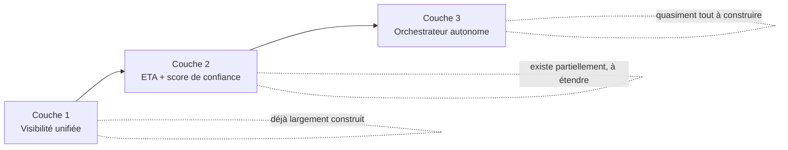

# Praxio (working name) — de la visibilité à l'action

> Dépôt de stratégie et d'architecture pour l'évolution d'[IncoKalk](https://github.com/Ybarzan/Incokalk) — plateforme de commerce international et douane française — vers une plateforme d'orchestration autonome à 3 couches. Ce dépôt contient les livrables d'audit et de planification ; le code de production reste dans le dépôt `Incokalk`.

## Le pitch

> *« Vos systèmes savent déjà qu'une expédition va être en retard. Praxio agit avant que ça devienne votre problème — réajuste la commande fournisseur, réalloue le stock, prévient le client — sans que vous ayez à ouvrir cinq écrans différents. »*

**Fermer l'écart entre savoir et faire — pour le commerce international.**

## Le constat de départ

L'audit du code existant (voir [docs/01-audit-existant.md](docs/01-audit-existant.md)) montre un socle plus mature qu'attendu : connecteurs transporteurs (DHL, MSC, CMA CGM, Geodis, DB Schenker), ERP bidirectionnel (Odoo, SAP B1), et un moteur ETA prédictif avec score de confiance déjà en production. Ce qui manque n'est pas la donnée — c'est la couche d'action : aucun moteur de règles conditionnelles au-delà d'un filtrage simple, aucun bus d'événements, aucune écriture automatique déclenchée par un événement métier. C'est précisément ce que cette refonte construit.

## Sommaire des livrables

| Document | Contenu |
|---|---|
| [docs/01-audit-existant.md](docs/01-audit-existant.md) | Audit factuel du code actuel, couche par couche, avec preuves (fichiers/services) |
| [docs/02-architecture-cible.md](docs/02-architecture-cible.md) | Architecture cible à 3 couches, diagrammes, composants, flux de données |
| [docs/03-plan-migration.md](docs/03-plan-migration.md) | Plan de migration en 3 phases avec jalons et Gantt indicatif |
| [docs/04-composants-techniques.md](docs/04-composants-techniques.md) | Détail de chaque nouveau composant technique, complexité relative |
| [docs/05-estimation-couts-risques.md](docs/05-estimation-couts-risques.md) | Estimation d'effort (2 lectures : cadence réelle vs semaines-personnes classiques) et risques par ordre d'impact |
| [docs/06-positionnement-gtm.md](docs/06-positionnement-gtm.md) | Nouveau pitch, propositions de nom, segmentation tarifaire, stratégie de mise sur le marché |

## Architecture cible en un coup d'œil

Détail complet dans [docs/02-architecture-cible.md](docs/02-architecture-cible.md).

## Principes qui contraignent chaque décision technique

- **API-first** — chaque nouveau composant expose une API avant toute UI
- **No-code pour l'utilisateur** — configuration des règles en langage naturel, jamais d'exécution de texte libre non validé
- **Cohabiter, pas remplacer** — les adaptateurs transporteurs/ERP/e-commerce existants restent l'unique point de contact avec les systèmes tiers
- **Modulaire** — chaque couche est vendable et déployable indépendamment
- **Gouvernance stricte** — toute action orchestrée reste dans un cadre défini par l'utilisateur (budget, transporteurs autorisés, seuil de validation humaine), bloquant à l'exécution et pas seulement déclaratif

## Statut

Document de travail — issu d'un audit de code direct le 2026-08-23, à valider avec l'équipe avant tout engagement de développement. Le dépôt de code reste [Ybarzan/Incokalk](https://github.com/Ybarzan/Incokalk) ; ce dépôt-ci est la couche stratégie/architecture, pas une réécriture du code.
