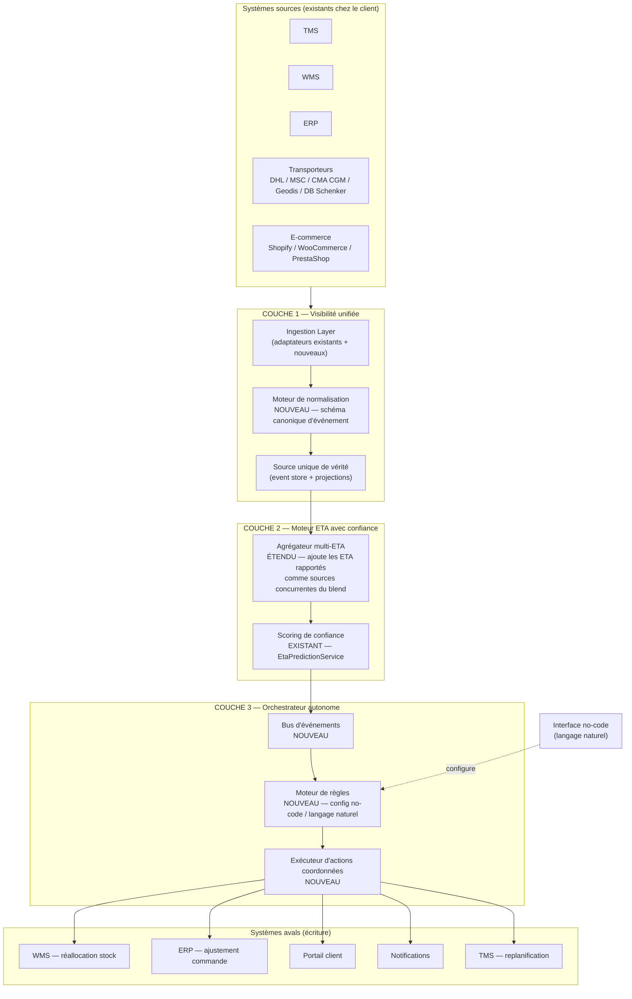

# Architecture cible — plateforme d'orchestration autonome à 3 couches

## Vue d'ensemble

---

## Couche 1 : Plateforme de visibilité unifiée

**Ce qui se construit sur l'existant** (pas de réécriture) :

- Les 5 adaptateurs transporteurs (`CarrierAdapter`), les 2 adaptateurs ERP (`ErpProvider`) et l'adaptateur Shopify restent l'interface d'accès aux systèmes tiers — ils sont conservés tels quels.
- **Nouveau : un schéma canonique d'événement** (`ShipmentEvent` — origine, destination, statut normalisé, horodatage, source, payload brut conservé) que chaque adaptateur doit désormais produire, au lieu de retourner directement son propre DTO au reste de l'application. Le parsing champ-par-champ existant (`buildBookingRequest`/`parseResponse`) devient l'implémentation *interne* de l'adaptateur ; sa sortie publique change.
- **Nouveau : un event store append-only** (table PostgreSQL partitionnée par `company_id` + `shipment_id`, ou introduction ciblée de TimescaleDB si le volume le justifie) qui devient la source unique de vérité, remplaçant la lecture directe et dispersée des tables `shipment`, `tracking_event`, `erp_sync_log`.
- **Marquage explicite réel vs simulé** : chaque événement porte un flag `dataSource: LIVE | SIMULATED`, condition non négociable avant de vendre la promesse « source unique de vérité ».
- **E-commerce en écriture** : ajout de `pushOrderStatus`/`pushEta` sur `ECommerceAdapter`, implémenté d'abord pour Shopify (webhooks sortants Shopify existent nativement côté plateforme).

## Couche 2 : Moteur ETA avec score de confiance

**Ce qui se construit sur l'existant** (extension, pas reconstruction) :

- `EtaPredictionService` garde sa cascade Python/Java/heuristique comme **une source parmi d'autres** dans un nouvel agrégateur.
- **Nouveau : capture des ETA rapportés** comme entrées concurrentes — l'ETA annoncé par le transporteur au moment du booking (déjà dans `BookingResponse`, jamais réutilisé après coup), l'ETA dérivé de la position AIS en temps réel (`AisStreamService` calcule déjà une position, pas encore une ETA), l'ETA du modèle prédictif existant, l'ETA historique moyen sur la même lane (`port_historical_delay_mean`, déjà en base côté douane — à réutiliser côté logistique).
- **Nouveau : pondération par fiabilité historique de source**, pas seulement par modèle — table `eta_source_reliability` (par transporteur × lane × mode), recalculée périodiquement à partir de l'écart réel constaté (déjà mesurable : `TrackingEvent` a les arrivées réelles, `EtaPrediction` a les prédictions passées).
- Le score de confiance existant (`confidencePercent`/`ConfidenceLevel`) devient la sortie de cette agrégation multi-source, avec le détail des sources et leurs poids exposé à l'utilisateur (traçabilité, pas juste un pourcentage opaque).

## Couche 3 : Orchestrateur autonome — la construction principale

C'est la seule couche qui part quasiment de zéro. Trois composants :

### a) Bus d'événements
Introduction d'un vrai bus (candidats : Kafka si le volume/l'écosystème le justifie, ou plus pragmatique pour une PME/ETI — **Spring `ApplicationEventPublisher` + table `outbox` PostgreSQL** pour garantir la livraison sans opérer une nouvelle brique d'infra lourde). Remplace les appels synchrones directs de `EventPublisher` vers `NotificationService`.

### b) Moteur de règles intelligent
Pas des règles si/alors fragiles — un moteur qui évalue des **options dans un cadre** :
- Représentation d'une règle : condition (seuils composés, ex. « confiance ETA < 70% ET retard prévu > 48h ET client tier Gold ») → ensemble d'actions candidates → contraintes (budget max, transporteurs autorisés, validation humaine requise au-delà d'un seuil).
- **Configuration en langage naturel** : un LLM traduit une instruction utilisateur (« si un conteneur en provenance de Chine a plus de 3 jours de retard et que le stock du produit associé passe sous 10 unités, propose une commande de réassort et préviens l'acheteur ») en règle structurée validée par un humain avant activation — pas d'exécution automatique de texte libre non validé.
- Le moteur doit rester interprétable (pas de boîte noire) : chaque décision journalisée avec la règle et les données qui l'ont déclenchée.

### c) Exécuteur d'actions coordonnées
Traduit une décision de règle en appels concrets vers les couches déjà existantes :
- Réallocation de stock → `WarehouseService` / `InventoryService` (déjà présents, jamais appelés automatiquement)
- Ajustement de commande fournisseur → `ErpProvider.exportOrders` (méthode déjà là, jamais déclenchée par un événement)
- Propagation ETA → portail client (déjà existant, `SharedTracking`), TMS/WMS externes (nouveau connecteur d'écriture), notifications (`NotificationService`, déjà là)
- Replanification de tournée → nécessite un nouveau service d'optimisation d'itinéraire déclenché par événement (`OptimizationService` existe déjà pour un usage manuel — à rendre déclenchable automatiquement)

---

## Principes non négociables reportés dans la conception

| Principe | Traduction technique concrète |
|---|---|
| API-First | Chaque nouveau composant (agrégateur ETA, moteur de règles, exécuteur d'actions) expose une API REST versionnée avant toute UI — cohérent avec le style déjà en place (`/v1/...`) |
| No-code utilisateur | L'éditeur de règles en langage naturel est une couche au-dessus d'un schéma de règle structuré — jamais d'exécution de texte libre sans compilation en règle typée et validation humaine |
| Cohabiter, pas remplacer | Les adaptateurs `CarrierAdapter`/`ErpProvider`/`ECommerceAdapter` restent l'unique point de contact avec les systèmes tiers ; l'orchestrateur ne parle jamais directement à un système externe, seulement via ces adaptateurs |
| Modularité | Les 3 couches sont déployables indépendamment (Couche 1 seule = produit de visibilité vendable ; +Couche 2 = ETA fiable ; +Couche 3 = orchestration) — correspond à la segmentation tarifaire recommandée en [06-positionnement-gtm.md](06-positionnement-gtm.md) |
| Gouvernance | Chaque règle d'orchestration hérite du multi-tenant existant (`company_id`) + un cadre explicite par entreprise (budget max, transporteurs autorisés, seuil de validation humaine) stocké et vérifié à l'exécution, pas seulement à la configuration |
