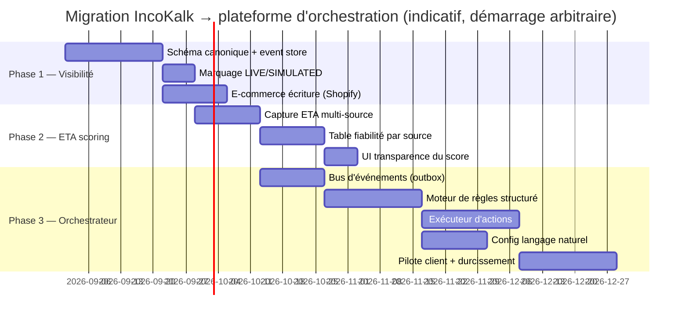

# Plan de migration en 3 phases

> Hypothèse de calibrage : équipe actuelle (1-2 développeurs full-stack + IA en pair-programming, cadence observée sur l'historique de commits IncoKalk). Les durées sont en semaines-calendaires à cette cadence, pas en semaines-personnes classiques de cabinet de conseil — voir [05-estimation-couts-risques.md](05-estimation-couts-risques.md) pour la conversion et un scénario à effectif renforcé.

---

## Phase 1 — Mise à niveau de la couche de visibilité (6 semaines)

**Objectif** : passer d'adaptateurs qui alimentent directement les tables métier à un event store canonique, sans casser aucune fonctionnalité existante.

| Jalon | Livrable | Critère de sortie |
|---|---|---|
| J1 | Schéma `ShipmentEvent` défini + table event store (partitionnée `company_id`) | Migration Flyway V60 revue, ADR (Architecture Decision Record) validé |
| J2 | Les 5 `CarrierAdapter` + 2 `ErpProvider` + `ShopifyAdapter` publient dans l'event store en plus de leur comportement actuel (double écriture) | Tests de non-régression backend verts, aucun endpoint existant modifié |
| J3 | Flag `dataSource: LIVE\|SIMULATED` propagé jusqu'au frontend | Le badge est visible sur `ShipTracker.tsx` et toute vue tracking |
| J4 | `ECommerceAdapter.pushOrderStatus/pushEta` implémenté pour Shopify | Un changement de statut IncoKalk se reflète dans Shopify sous 5 min |
| J5-J6 | Bascule des lectures existantes (dashboard, portail client) de la lecture directe des tables vers des projections issues de l'event store | Dashboard et portail client passent aux nouvelles projections, ancien chemin de lecture retiré |

**Ne pas faire en Phase 1** : ne pas toucher au moteur de règles ni à l'ETA — c'est une fondation de données, elle doit être invisible pour l'utilisateur final au démarrage (double écriture, bascule progressive).

---

## Phase 2 — Moteur ETA avec scoring (5 semaines)

**Objectif** : transformer le blend interne existant (Python/Java/heuristique) en agrégateur multi-source incluant les ETA réellement rapportés.

| Jalon | Livrable | Critère de sortie |
|---|---|---|
| J1-J2 | Capture systématique de l'ETA annoncé au booking (déjà dans `BookingResponse`, non persisté après coup) + ETA dérivé AIS | Table `eta_reported_sources`, alimentée à chaque booking et chaque cycle de polling AIS |
| J3-J4 | Table `eta_source_reliability` (transporteur × lane × mode), calculée depuis l'écart historique réel (`TrackingEvent` vs `EtaPrediction` passées) | Job planifié hebdomadaire, historique d'au moins 4 semaines de données avant mise en production du poids calculé |
| J5 | Agrégateur final : `confidencePercent` devient fonction du blend multi-source pondéré, pas uniquement du modèle ML interne | A/B interne : comparer l'ancien score vs le nouveau sur les 90 derniers jours d'expéditions clôturées, MAE mesurée |

**Dépendance dure sur Phase 1** : l'agrégateur lit l'event store, pas les tables directement — Phase 2 ne peut pas commencer avant que J2 de Phase 1 soit stable (mais peut chevaucher J3-J6 de Phase 1, cf. Gantt).

---

## Phase 3 — Orchestrateur autonome (10-13 semaines, la plus lourde)

**Objectif** : fermer la boucle savoir → faire, en commençant par le cas d'usage à plus forte valeur perçue (réallocation stock ou ajustement fournisseur sur retard, à confirmer avec 2-3 clients pilotes avant de généraliser).

| Jalon | Livrable | Critère de sortie |
|---|---|---|
| J1-J2 | Bus d'événements (pattern outbox PostgreSQL + `ApplicationEventPublisher`) | Les événements ETA dégradé / statut changé transitent par le bus, `EventPublisher` actuel migré dessus sans régression notification |
| J3-J5 | Moteur de règles structuré (condition composée → action candidate → contrainte de gouvernance) | Schéma de règle versionné, moteur d'évaluation testé sur 20+ scénarios de règles représentatifs |
| J6-J8 | Exécuteur d'actions coordonnées — **1 seul cas d'usage complet en premier** (recommandé : ajustement commande fournisseur via `ErpProvider.exportOrders` sur ETA dégradé confirmé) | Un scénario de bout en bout démontrable : ETA se dégrade → règle se déclenche → commande ajustée dans Odoo/SAP, journal d'audit complet |
| J9-J10 | Configuration en langage naturel (LLM → règle structurée → validation humaine obligatoire avant activation) | Interface no-code testée par un non-développeur (client pilote), taux de règles correctement traduites mesuré manuellement sur 30 formulations |
| J11-J13 | Pilote avec 2-3 clients réels, durcissement (limites budgétaires, transporteurs autorisés, rollback d'action, alerting sur échec d'action) | Pilote validé, cadre de gouvernance (budget/permissions) effectivement bloquant en test, pas seulement déclaratif |

**Ce que la Phase 3 ne couvre volontairement pas au premier tour** : réallocation de stock multi-entrepôt et replanification de tournée sont des cas d'usage 2 et 3 — à ajouter après validation du premier cas d'usage sur un pilote réel, pas en parallèle (risque de diluer l'effort sur un moteur encore non éprouvé en production).

---

## Dépendances et risques de séquencement

- Phase 2 dépend de Phase 1 (event store comme source de lecture) mais peut démarrer sa capture de données avant que Phase 1 soit 100% terminée (chevauchement volontaire dans le Gantt).
- Phase 3 dépend de Phase 1 (bus consomme l'event store) mais **pas** de Phase 2 au sens strict — le moteur de règles peut se déclencher sur un changement de statut simple avant que le scoring ETA multi-source soit fini. Ne pas bloquer Phase 3 sur l'achèvement complet de Phase 2.
- Le point de non-retour commercial est la fin de Phase 1 J6 (bascule des lectures) — prévoir une fenêtre de gel des nouvelles features produit pendant cette semaine-là, comme pour toute migration de source de vérité.
