# Intégration des données externes (AS24, tachygraphe, GPS, carburant)

Ce document décrit comment brancher des **vraies données** dans Fleet Hub, à la place des
données de démonstration générées par `DataSeeder`.

Le squelette d'intégration est dans `backend/src/main/java/com/fleethub/integration/` :

```
integration/
├── IntegrationProperties.java     # Config "integration.*" de application.yml
├── IntegrationSyncService.java    # Orchestrateur @Scheduled (tâches de fond)
├── TachographSource.java          # Interface "temps de conduite"
├── GpsSource.java                 # Interface "positions temps réel"
├── CostSource.java                # Interface "coûts / carburant"
├── TachogramSource.java           # Exemple d'implémentation REST (tachygraphe)
└── dto/                           # Objets échangés avec les fournisseurs
    ├── TachographDayDto.java
    ├── GpsPositionDto.java
    └── FuelTransactionDto.java
```

## Principe

Chaque famille de données a une **interface** (le "contrat") et une **implémentation par
fournisseur**. L'orchestrateur `IntegrationSyncService` récupère, normalise et persiste les
données dans les entités déjà existantes :

| Interface | Entité cible | Données |
|---|---|---|
| `TachographSource` | `TachographDay` | heures de conduite/travail, conformité 561/2006 |
| `GpsSource` | `Truck` (lat/lon/vitesse/statut) | position temps réel |
| `CostSource` | `FuelRecord` | litres, montant, kilométrage |

La jointure entre les données du fournisseur et la base se fait par deux **clés métier** :
`licenseNumber` (numéro de permis du chauffeur) et `registration` (immatriculation du camion).

## Pipeline : API → KPIs (vue d'ensemble)

```mermaid
flowchart LR
    subgraph EXT["Sources externes"]
        A1["Tachygraphe<br/>Tachogram / TachoShare<br/>AS24 Tak&drive (fichiers)"]
        A2["GPS temps réel<br/>Balise / Webfleet / Geotab"]
        A3["Coûts carburant<br/>AS24 Infoservice / carte"]
    end

    subgraph INT["Couche d'intégration  ·  com.fleethub.integration"]
        B1["TachographSource<br/><i>interface</i>"]
        B2["GpsSource<br/><i>interface</i>"]
        B3["CostSource<br/><i>interface</i>"]
        B4["TachogramSource<br/><i>impl. REST par fournisseur</i>"]
        B5["DTO normalisés<br/>TachographDayDto · GpsPositionDto · FuelTransactionDto"]
    end

    subgraph ORCH["IntegrationSyncService  ·  tâches @Scheduled"]
        C1["02:15 · tachygraphe"]
        C2["toutes les 60 s · GPS"]
        C3["03:30 · carburant"]
        C4["Jointure clés métier<br/>licenseNumber / registration"]
        C5["Contrôle idempotence<br/>(anti-doublon)"]
    end

    subgraph DB["Base de données"]
        D1["TachographDay"]
        D2["Truck<br/>(lat · lon · statut · vitesse)"]
        D3["FuelRecord"]
    end

    subgraph KPI["Moteur de calcul  ·  service"]
        E1["KpiService + DashboardService"]
        E2["14 KPIs par couple<br/>+ score composite + alertes"]
    end

    subgraph API["API REST  ·  controller"]
        F1["/api/dashboard/summary"]
        F2["/api/kpis/couples · /api/kpis/couples/{id}"]
        F3["/api/map/vehicles"]
    end

    subgraph UI["Frontend React"]
        G1["Tableau de bord<br/>(4 KPIs North Star)"]
        G2["Chauffeurs + drill-down"]
        G3["Carte temps réel"]
    end

    A1 -- "fetchDrivingDays(since)" --> B1 --> B4
    A2 -- "fetchPositions()" --> B2
    A3 -- "fetchTransactions(since)" --> B3
    B4 --> B5
    B2 -- impl REST --> B5
    B3 -- impl REST / fichiers --> B5

    B5 --> C1
    B5 --> C2
    B5 --> C3
    C1 & C2 & C3 --> C4 --> C5

    C5 -- upsert chauffeur+date --> D1
    C5 -- update en place --> D2
    C5 -- upsert camion+date --> D3

    D1 & D2 & D3 --> E1
    E1 --> E2
    E2 --> F1
    E2 --> F2
    D2 --> F3
    F1 --> G1
    F2 --> G2
    F3 --> G3
```



Lecture du schéma, de gauche à droite :

1. **Sources externes** → la couche d'intégration les appelle selon leur mode
   (API REST pour Tachogram/Webfleet, fichiers pour AS24).
2. **Interfaces + DTOs** : chaque famille est isolée derrière un contrat ; les données
   hétérogènes sont normalisées en DTOs.
3. **Orchestrateur** : trois tâches planifiées récupèrent les données, font la jointure
   par clés métier, puis appliquent l'idempotence avant écriture.
4. **Entités JPA** : `TachographDay`, `Truck` (positions GPS) et `FuelRecord` alimentent
   le moteur de calcul.
5. **KpiService** : agrège les entités par période (Jour / Semaine / Mois) en 14 KPIs
   par couple, plus un score composite et des alertes.
6. **API REST puis Frontend** : le tableau de bord, le drill-down et la carte ne font que
   consommer ces KPIs déjà calculés.

## Configuration

Tout est désactivé par défaut. Pour activer une source, éditez `application.yml`
(ou une variable d'environnement en production) :

```yaml
integration:
  tacho:
    enabled: true
    provider: "tachogram"      # tachogram | as24-files | webfleet | ...
    base-url: "https://..."
    api-key: "${TACHO_API_KEY}"
    sync-days-back: 7          # profondeur de re-synchronisation (jours)
  gps:
    enabled: true
    provider: "webfleet"       # webfleet | wialon | geotab | balise-gps
    base-url: "https://..."
    api-key: "${GPS_API_KEY}"
  cost:
    enabled: true
    provider: "as24-infoservice"
    base-url: "https://..."
    api-key: "${AS24_API_KEY}"
    sync-days-back: 30
```

Planification (dans `IntegrationSyncService`) :
- **Tachygraphe** : chaque nuit à 02:15 (`0 15 2 * * *`)
- **GPS** : toutes les 60 secondes (`fixedDelay`)
- **Carburant** : chaque nuit à 03:30 (`0 30 3 * * *`)

## Ajouter un fournisseur

1. Implémentez l'interface correspondante (`TachographSource`, `GpsSource` ou `CostSource`).
2. Annotéez avec `@Component @ConditionalOnProperty(...)`, comme `TachogramSource`.
3. L'orchestrateur le détecte automatiquement via `ObjectProvider` et il suffit de
   positionner `integration.<famille>.provider` à votre valeur.

## Les 3 sources recommandées

### 1. Temps de conduite → Tachogram ou Webfleet TachoShare.connect (le plus simple)

Des **APIs REST documentées** exposent directement les données lisibles (temps de travail,
heures de conduite, infractions, km). `TachogramSource` est un exemple prêt à adapter
(il appelle `GET /api/v1/driving-days?since=...` avec un header `Authorization: Bearer <key>`).

### 2. Coûts → AS24 Infoservice (fichiers)

AS24 met à disposition des fichiers de facturation (formats **DSW, DSW+, AUL, AUL 2**, en
XLS/ASCII) à télécharger sur l'Espace Client. L'intégration se fait en deux temps :
- un import manuel ou un watcher qui dépose les fichiers exportés ;
- un parser qui convertit chaque ligne en `FuelTransactionDto` (immatriculation, date,
  litres, montant, kilométrage) puis laisse `IntegrationSyncService` persister.

### 3. GPS temps réel → API de votre balise (ou Webfleet / Geotab / Wialon)

Polling léger toutes les minutes. Le statut du véhicule est déduit de la vitesse
(`ROULAGE` si > 0, sinon `ARRET`).

## AS24 Tak&drive (tachygraphe) — cas particulier

AS24 **Tak&drive** décharge les données du chronotachygraphe **en station** (le chauffeur
passe la carte), puis les rend disponibles sur l'extranet quelques minutes après, sous forme
de **fichiers au format européen (DDD)**. Ce n'est pas une API temps réel :
- intégration **par fichiers** (téléchargement extranet → parser DDD/CSV → `TachographDay`) ;
- ou passer par un outil intermédiaire qui fournit une API (Tachogram, TachoShare).

À vérifier directement auprès d'AS24 si un accès API (Espace Client / partenaires) est
disponible pour votre contrat.

## Canal de poussée (push) — page « Intégrations » (self-service)

Depuis le back-office (`/integrations`, rôle ADMIN du tenant), chaque société peut
enregistrer ses propres fournisseurs sans intervention de la plateforme :

- **`GET /api/integrations`** — lister les configurations (clé API toujours masquée).
- **`GET /api/integrations/providers`** — métadonnées des fournisseurs disponibles
  (GPS, tachygraphe, carburant, DHL) pour construire le formulaire.
- **`POST /api/integrations` / `PUT /api/integrations/{id}` / `DELETE /api/integrations/{id}`** —
  créer, modifier, supprimer. La clé API fournisseur est **chiffrée au repos** (AES-GCM,
  clé dérivée de `INTEGRATION_SECRET_KEY`) et jamais renvoyée.
- **`POST /api/integrations/{id}/test`** — tester une configuration enregistrée ;
  **`POST /api/integrations/test`** — tester un brouillon avant enregistrement.

Chaque configuration génère une **clé de webhook** (`webhookKey`) que le client transmet
au fournisseur. Le fournisseur envoie ses données en `POST /api/webhooks/ingest` avec le
header `X-API-Key` ; les données sont alors rattachées à la **société de la clé**
(jointure scopée `company_id`, tenant-isolée). La clé partagée globale
`integration.webhook-api-key` reste supportée comme mode historique.

Payload accepté (identique au mode global) : `positions[]`, `tachographDays[]`,
`fuelTransactions[]` — voir `IngestPayload` et `IntegrationConfigTest`.

## Règles de robustesse déjà intégrées

- **Idempotence** : le tachygraphe (chauffeur + date) et le carburant (camion + date +
  litres/montant) ne sont jamais dupliqués ; le GPS met à jour en place.
- **Tolérance aux données inconnues** : une donnée dont la clé métier ne correspond à aucun
  chauffeur/camion est ignorée et loggée.
- **Sécurité** : les clés API passent par variables d'environnement, jamais dans le code.
- **Fuseaux horaires** : à adapter au fournisseur si les horodatages ne sont pas UTC.

## Étapes à venir (non implémentées)

- Parser des fichiers binaires DDD (librairie dédiée) pour l'import Tak&drive.
- Watcher FTP / import manuel CSV pour AS24 Infoservice.
- Cache Redis des positions GPS (remplace le polling minute).
- Archivage réglementaire des fichiers tachygraphe (28 jours conducteur / 90 jours véhicule).

---

## Roadmap restante — prompt d'implémentation (à copier-coller dans un agent IA)

> Ce bloc est un **prompt autonome** à injecter dans un agent de code (opencode, Copilot, Claude Code…)
> pour poursuivre le développement de Fleet Hub. Il couvre tout ce qui reste en dehors du périmètre
> déjà livré (MVP SaaS multi-tenant + KPIs + intégrations externalisées).

### Contexte pour l'agent

Fleet Hub est un SaaS de gestion de flotte poids lourds : **backend Spring Boot 3.4 (Java 21, Maven)**
dans `backend/`, **frontend React 18 + Vite** dans `frontend/`. Il est **multi-tenant** : chaque
société cliente (`Company`) a ses données isolées via la colonne `company_id` et le scoping explicite
des repositories (`TenantContext` ThreadLocal, `TenantFilter`, `AppUserPrincipal`). Rôles :
`SAAS_ADMIN` (opérateur plateforme, sans société), `ADMIN` / `GESTIONNAIRE` (tenant). Le login bloque
les sociétés suspendues ou en essai expiré (403). Plans : TRIAL (10 véh/5 chauf), STARTER (25/10),
PRO (100/50), ENTERPRISE (illimité). Back-office `/api/admin/companies` déjà fonctionnel.
H2 en dev (`create-drop`, données seedées à chaque démarrage), PostgreSQL en prod (`profil prod`).
Tests : `mvn test` (backend), `npm test` + `npx playwright test` (frontend, backend sur :8090 requis).

### Dettes techniques à traiter en priorité (bloquantes)

> **État : résolues.** Ces trois dettes ont été traitées et sont verrouillées par des tests
> (`IntegrationIngestTest`, `LoginRateLimitTest`, `SaaSAdminBootstrapTest`) :

1. **`IntegrationSyncService` renseigne `company_id`** : les variantes tenant-scopées
   (`ingestTachographDays(data, companyId)`, `ingestGpsPositions(positions, companyId)`,
   `ingestFuelTransactions(transactions, companyId)`) rattachent chaque donnée importée à la
   société du chauffeur/camion trouvé par clé métier (`licenseNumber`, `registration`) ; à défaut,
   la donnée est ignorée + loggée (comportement existant). `IntegrationIngestTest` vérifie que
   `TachographDay` et `FuelRecord` portent bien le `company_id` attendu.
2. **`LoginRateLimitFilter` couvre `/api/auth/login` ET `/api/auth/register`**
   (`shouldNotFilter` refuse tout sauf ces deux POST). `LoginRateLimitTest` vérifie le 429
   sur les deux endpoints.
3. **Bootstrap du premier `SAAS_ADMIN` en production** : `SaaSAdminBootstrap`
   (`ApplicationRunner`, `@Order(2)`, après le seeder) crée `saasadmin`
   (email `ops@fleethub.fr`) avec `ADMIN_PASSWORD` si le seeder est désactivé
   (`app.seed.enabled=false`). `SaaSAdminBootstrapTest` valide le comportement avec seed coupé.

### Chantier A — Facturation Stripe (le plus gros, faire d'abord)

- **Checkout d'abonnement** : `POST /api/checkout/session` (tenant connecté) → crée une session
  Stripe pour le plan choisi (STARTER/PRO/ENTERPRISE), `mode: subscription` avec `trial_end`
  (fin d'essai en cours si TRIAL). Enregistrer `subscriptionProvider="stripe"`,
  `subscriptionId` sur la `Company` (champs déjà présents).
- **Webhook** `POST /api/webhooks/stripe` (payload brut + vérification signature) : gérer
  `customer.subscription.updated`, `checkout.session.completed`, `invoice.payment_failed`,
  `customer.subscription.deleted`. Bascule du statut `Company` : ACTIVE / SUSPENDED / CANCELLED.
  Ne **pas** exposer la clé secrète webhook dans le code (env `STRIPE_WEBHOOK_SECRET`).
- **Portail de facturation** : bouton « Gérer mon abonnement » → `billing_portal.sessions.create`.
- **Changement de plan payant** : `subscriptions.update` (prorata), synchroniser `Company.plan`.
- **Frontend** : page « Abonnement » (`/billing`) listant le plan courant, les limites, le bouton
  checkout et le portail. Rafraîchir les limites sans ré-authentification (payload JWT inchangé,
  lire le plan côté serveur, pas dans le token).
- **Tests** : unitaires (validation des montants/plans, mapping statuts), intégration webhook
  avec signature mockée, e2e si possible. Ajouter des variables à `.env.example`
  (`STRIPE_SECRET_KEY`, `STRIPE_WEBHOOK_SECRET`, `STRIPE_PRICE_*`).

### Chantier B — RGPD / France-UE

- **Portail vie privée** : page `/account/privacy` (rôle tenant) avec :
  - **Export** de toutes les données personnelles (chauffeurs, trajets, événements, coûts,
    utilisateurs) en JSON/CSV → `GET /api/account/export` (job asynchrone + notification).
  - **Suppression du compte** : `DELETE /api/account` → supprime les données de la société
    (hard delete, droit à l'effacement) après confirmation ; ou `anonymisation` (soft) à trancher.
- **Journalisation des accès** : table `audit_log` (userId, action, ip, timestamp) alimentée par un
  filtre/interceptor sur les mutations ; interface de consultation réservée au tenant admin.
- **Mentions légales / DPO** : endpoints `GET /api/legal/terms` et `/api/legal/privacy` (versionnées).
- **Hébergement EU** : documenter dans README/INTEGRATION les choix (PostgreSQL EU, aucun transfert
  hors UE, sous-traitants avec DPA) — pas de code nécessaire, mais vérifier que rien ne sort de l'UE
  (analytics, erreurs).
- **Tests** : export complet dans le périmètre tenant, suppression cascade, absence de fuite
  cross-tenant, logs d'accès écrits.

### Chantier C — Gestion des utilisateurs par société

- `GET/POST/PUT/DELETE /api/users` (tenant ADMIN uniquement) : lister, inviter (email + token
  d'invitation), désactiver, changer rôle (ADMIN/GESTIONNAIRE) — jamais créer de `SAAS_ADMIN`.
- Invitation : lien sécurisé à durée limitée, acceptation → activation du compte (mot de passe).
- **Frontend** : page `/users` (table + formulaire d'invitation), garde rôle ADMIN.
- **Tests** : invariants (≥1 ADMIN actif, pas de SAAS_ADMIN côté tenant), validation email.

### Chantier D — Emails transactionnels

- Service d'envoi abstrait (`EmailService`, interface + implémentation SMTP ou provider)
  désactivé par défaut en dev (log), activé via `app.mail.*`.
- Événements : bienvenue à l'inscription, **rappel d'expiration d'essai** (J-7, J-1 via tâche
  planifiée), suspension/réactivation, paiement échoué.
- Contenus en français, modèles HTML simples, `from` vérifié. Variables dans `.env.example`.

### Chantier E — Vraies APIs données (GPS, tachygraphe, coûts)

- Implémenter les fournisseurs derrière les interfaces existantes (`TachographSource`,
  `GpsSource`, `CostSource`) en respectant le schéma déjà documenté plus haut :
  - **GPS** : polling `@Scheduled` toutes les 60 s, jointure par `registration`, statut déduit
    de la vitesse (ROULAGE/ARRET), idempotence (update en place).
  - **Tachygraphe** : `TachogramSource` (REST) existant à adapter, puis **parser DDD** pour AS24
    Tak&drive (fichiers) si accès fichier.
  - **Coûts** : parser CSV/DSW/DSW+/AUL pour AS24 Infoservice + watcher FTP/import manuel.
- **Faire passer le flag `integration.*.enabled` et vérifier** : données importées → KPIs recalculés,
  aucune violation `company_id` (cf. dette n°1).
- Archivage réglementaire tachygraphe (28 j conducteur / 90 j véhicule).

### Chantier F — Alertes temps réel

- Configurer des **seuils par société** (table `alert_rule` : type, opérateur, valeur, canal).
- Moteur d'évaluation : dépassement temps de conduite 561/2006, immobilisation imprévue,
  consommation anormale, expiration d'essai/contrôle technique.
- Canaux : in-app (table `notification` + compteur dans la sidebar) et email (Chantier D).
- **Frontend** : centre de notifications, page de configuration des règles.

### Chantier G — Redis (cache positions)

- Redis pour les positions GPS (`GpsPositionDto` en cache clé `gps:{companyId}:{truckId}`,
  TTL 60 s) en remplacement du polling ; le driver H2/Postgres reste la source de vérité.
- Activé via `app.cache.redis.enabled` ; en dev, fallback mémoire (aucune nouvelle dépendance
  infra si possible). Documenter la config dans `application.yml` + `.env.example`.

### Chantier H — CI/CD + monitoring

- Pipeline GitHub Actions : `mvn test` + `npm test` + `npm run build` + Playwright (desktop)
  avec backend de test lancé ; build image Docker + push sur registry au push sur `main`.
- Monitoring : acteur JSON structurés (Log4j2), métriques Prometheus (`micrometer`),
  healthchecks (`/actuator/health`), alerting Sentry ou équivalent pour les erreurs 5xx.
- Docker-compose : service redis optionnel (Chantier G).

### Règles transverses

- **Ne jamais casser le multi-tenant** : toute nouvelle entité porte `company_id` ; tout accès
  passe par `TenantContext` ; nouveaux tests `TenantIsolationTest` si périmètre étendu.
- **Secrets uniquement en variables d'environnement** (`.env.example` à jour).
- **RGPD dès la conception** : minimisation, export/effacement disponibles (Chantier B).
- **Tests** : chaque chantier = tests unitaires + tests d'intégration ; la suite complète
  (`mvn test`, `npm test`, `npx playwright test`) doit rester verte.
- **Docs** : mettre à jour `README.md` (fonctionnalités, API, roadmap), `RECAP.md` et `.env.example`
  à la fin de chaque chantier.
- Démarrer par les **dettes techniques 1→3**, puis **Chantier A (Stripe)**, puis **B → H** par
  ordre de priorité métier. Vérifier chaque étape par `mvn test` côté backend.
